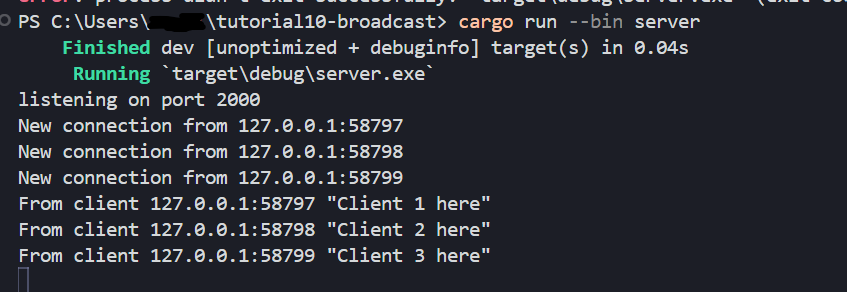
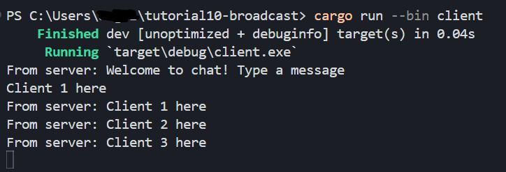
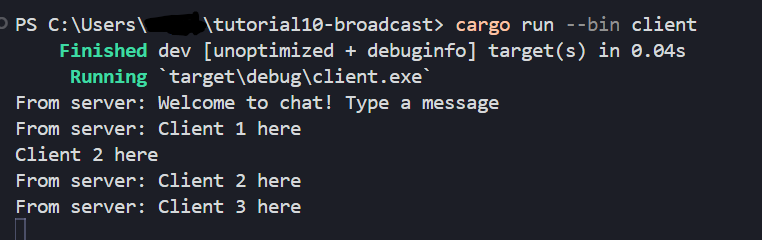
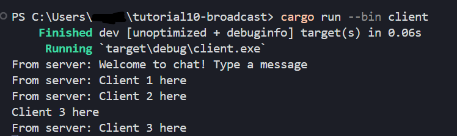
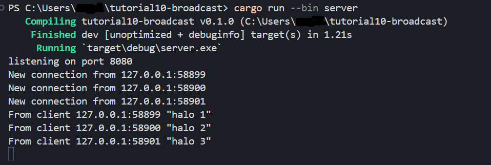
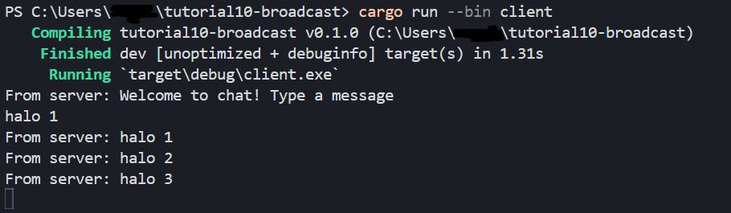
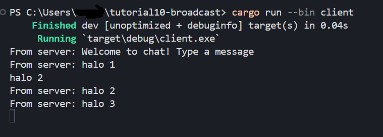
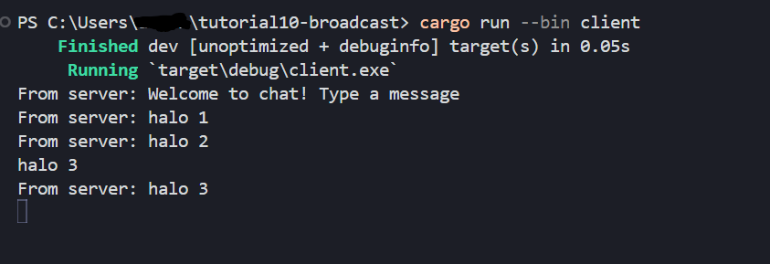
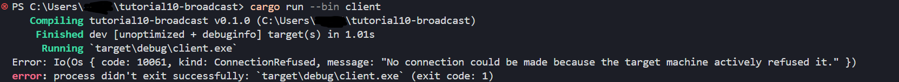

# Experiment README
## Experiment 2.1: Original code, and how it run
  
  
  
  
- Dari output di atas dapat kita lihat bahwa server akan menjadi listener dan menerima connection dari tiap client. Dapat kita lihat Server akan menerima dan memberikan message baru yang diberikan. Setiap client dapat membuat message dan menerima message dari client lain yang terkoneksi dan diproses oleh server.

## Experiment 2.2: Modifying port
  
  
  
  
- Apabila kita mengganti port server dan client dengan port yang sama. Maka, aplikai akan tetap berjalan dengan baik seperti gambar di atas.
  
- Namun, jika kita mengganti salah 1 port client atau server maka akan muncul error karena client tidak menemukan target server dengan port yang sesuai seperti foto di atas.
